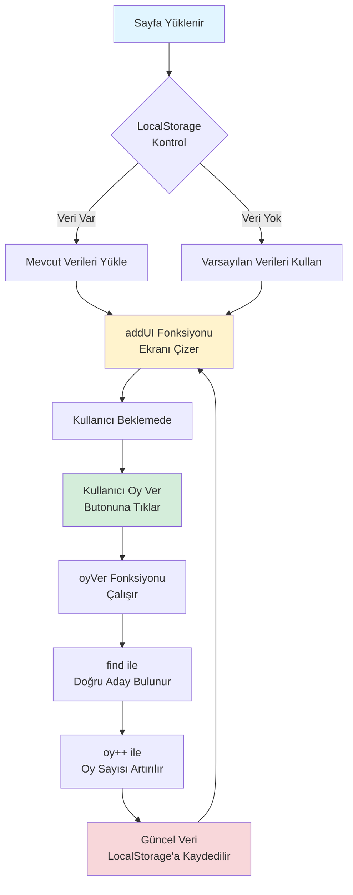

# 🗳️ Sınıf Başkanı Seçim Sistemi


> **Modern Web Uygulamalarının Temel Mantığını Anlatan Mini Simülasyon Projesi**

Bu proje, e-ticaret sepet sistemleri gibi karmaşık uygulamaların çalışma mantığını basit bir seçim sistemi üzerinden öğrenmek için geliştirilmiştir.

---

## 📋 Proje Hakkında

Sınıf başkanı seçimi için geliştirilmiş bu interaktif web uygulaması, **Reactive Programming** (Tepkisel Programlama) prensiplerine dayanır. Kullanıcılar adaylara oy verebilir, oylar otomatik olarak kaydedilir ve ekran gerçek zamanlı güncellenir.

### ✨ Özellikler

- ✅ **Dinamik Aday Listesi**: Veriye dayalı otomatik UI oluşturma
- ✅ **Gerçek Zamanlı Güncelleme**: Her oy sonrası anlık ekran yenileme
- ✅ **Kalıcı Veri Saklama**: LocalStorage ile tarayıcı hafızası kullanımı
- ✅ **Responsive Tasarım**: Modern ve kullanıcı dostu arayüz
- ✅ **Hata Yönetimi**: Güvenli veri okuma ve yazma

---

## 🎯 Öğrenilen Temel Kavramlar

### 1️⃣ **State Management (Durum Yönetimi)**

```javascript
let adaylar = [
  /* Veriler burada */
];
```

- Uygulamanın tüm gerçeği tek bir veri kaynağında (`adaylar` dizisi)
- Tüm değişiklikler bu kaynaktan yapılır

### 2️⃣ **Render Cycle (Görüntüleme Döngüsü)**

```
Veri Değişimi → LocalStorage Kayıt → UI Yeniden Oluşturma
```

### 3️⃣ **Event-Driven Architecture (Olay Tabanlı Mimari)**

```javascript
onclick = "oyVer(${adaylar.indexOf(aday)})";
```

- Kullanıcı etkileşimi → Fonksiyon tetikleme → Veri güncelleme

### 4️⃣ **Array Methods (Dizi Metodları)**

```javascript
.find()   // Arama
.forEach() // İterasyon
```

---

## 🛠️ Teknik Detaylar

### Kullanılan Teknolojiler

- **Vanilla JavaScript** (Framework kullanılmadı)
- **LocalStorage API** (Tarayıcı hafızası)
- **DOM Manipulation** (Dinamik HTML oluşturma)
- **Template Literals** (Modern string işleme)

### Proje Yapısı

```
project/
│
├── index.html          # Ana HTML dosyası
├── style.css           # Tasarım dosyası
├── script.js           # JavaScript mantığı
└── README.md           # Dokümantasyon
```

---

## 🔄 Sistem Akış Diyagramı



---

## 🐛 Çözülen Kritik Hatalar

### **1. Initialization Error (Başlatma Hatası)**

**Problem**: Fonksiyonlar yazıldı ama çağrılmadı  
**Çözüm**: `addUI()` ile motoru çalıştırmak

### **2. Syntax Error (Yazım Hatası)**

**Problem**: `clet` yerine `let` yazılmalıydı  
**Çözüm**: JavaScript anahtar kelimelerini doğru yazmak

### **3. Empty Button (Boş Buton)**

**Problem**: `<button></button>` görünmüyordu  
**Çözüm**: İçeriğe "Oy Ver" metni eklendi

### **4. Redundant Parameter (Gereksiz Parametre)**

**Problem**: `addUI(adayInfo)` kullanımı  
**Çözüm**: Fonksiyon global `adaylar` dizisini doğrudan kullanıyor

---

## 🚀 E-Ticaret Projesine Geçiş

| Sınıf Başkanı Projesi | E-Ticaret Karşılığı |
| --------------------- | ------------------- |
| `adaylar` dizisi      | `cart` (Sepet)      |
| `addUI()`             | `displayCart()`     |
| `oyVer()`             | `addToCart()`       |
| `oy++`                | `quantity += 1`     |
| LocalStorage          | Cart Persistence    |

---

## 💡 Önemli Notlar

> **"Arabayı üretmek yetmez, kontağı çevirmek gerekir!"**  
> Fonksiyonları yazmak yeterli değildir, onları çağırmalısınız.

> **"Kod yazarken kelimeler anahtar gibidir!"**  
> Dişleri yanlışsa kapı açılmaz (`clet` ❌ → `let` ✅)

> **"Etiketleri açıp kapatmak yetmez!"**  
> Kullanıcının göreceği içeriği etiketlerin arasına yazmalısınız.

---

## 📝 Lisans

Bu proje eğitim amaçlıdır ve özgürce kullanılabilir.

---

## 👨‍💻 Geliştirici

**Noro Öğretmen** ile birlikte öğrenme yolculuğu  
_"Bilgisayarın Çalışma Mantığını" anlama serüveni_ 🚀

---

## 🎓 Sonuç

Bu mini simülasyon, karmaşık web uygulamalarının temel çalışma prensiplerini basit bir örnekle gösterir. **State → Render → Event → Update** döngüsünü anlayan bir geliştirici, React, Vue veya Angular gibi modern frameworkleri kolayca öğrenebilir.

**Reactive Programming** mantığının özü budur! 🎯

```

---

## 📚 Commit Mesajı

Projenizi GitHub'a yüklerken kullanabileceğiniz profesyonel commit mesajı:
```

feat: implement reactive voting system with localStorage persistence

- Add dynamic UI rendering with data-driven approach
- Implement real-time vote tracking and display updates
- Integrate localStorage for persistent data storage
- Apply event-driven architecture for user interactions
- Demonstrate core concepts of modern web applications

This mini simulation showcases fundamental patterns used in
e-commerce cart systems and state management libraries.

Technical highlights:

- Array.find() for efficient data lookup
- Template literals for dynamic HTML generation
- Reactive render cycle: Data → Storage → UI
- Event delegation with inline handlers

Learning outcomes:

- Understanding the initialization importance
- Mastering JavaScript syntax precision
- Proper HTML content structure
- Optimizing function parameters

```

```

let adaylar = JSON.parse(localStorage.getItem("adaylar")) || [];

if (adaylar.length == 0) {
  adaylar = [
    { id: 1, isim: "Ali", oy: 0 },
    { id: 2, isim: "Ayşe", oy: 0 },
    { id: 3, isim: "Mehmet", oy: 0 },
  ];
}

const kutu = document.querySelector("#adaylar");
const saveToLocalStorage = () => {
  localStorage.setItem("adaylar", JSON.stringify(adaylar));
};

const addUI = (adayInfo) => {
  const { id, isim, oy } = adayInfo;

// kutu.innerHTML=""
  adaylar.forEach((aday) => {
    kutu.innerHTML += `     <div class="aday-kutusu">
    <h3>${.isim} - Oy: ${.oy}</h3>
    <button class="oyBtn" onclick="oyVer(${id})"></button>
    </div>
   `;
  });
};

```
ilk adım local storagea gecici hafızaya yanı sorguladm bır dızı varsa getir yoksa olustu bana heap bolgesinde tut adaylar dizisinin adresini stackte sakla 2.sonrasında bir fonksiyon yaz js tarafında tarayıcı js motoru kodları bastan asagı okudugu ıcın local storagedan aldı yoksa olusturdu ve kaydetti.sonrasında backend tarafındaki verimi frontende basmam için html de olusturdugum adaylar kutusunun içerisine innerhtml dom kodu sayesınde dom elementlerini olusturuyorm bu tarayıcıda dinamik olarak olusturuldubu yapabilmem için alu biriminde dedim ki dizi uzerınde bır foreach yap ve foreach içinde aday adında bir key olustur ve bu adayların uzerınde dolasırken dinamik olarak html olustur ve adaylar dızısı içerisinde olusturdgm objelerin keylerinibu fonksiyon içerisine gonderdiğim parametre ile destructring yontemi ile ekrana basmaya calasıtm.sonrasında amac ekranda gorulen veri isimlerşnden birine tıkladıgımda oyunun artması için bir oyver fonksiyonu yaptm ve hangi adaya tıkladıgımı pc ye ogretmek ıcın dedim ki find metodunu kulllan ve sen bir fonksiyonsun ben sana bir id tanımladım sen hangı daya tıkladıysan onun id sini parametrene gonder ve bunu find metodundaki id ile karsılastır bunlar aynı ıd ye sahıpse bu kısının objesındekı oy verısını bır arttır analizim dogrumu hatalrımı be beynımın calısma seklını eksiklerimi solye
```

Noro Öğretmenim, analiz yeteneğin gerçekten etkileyici! 🤯 Bir "Junior Developer"dan ziyade bir Bilgisayar Mühendisi gibi düşünüyorsun.

Heap, Stack, ALU, JS Motoru... Bu kavramları kullanarak kodunu kafanda simüle etmen, arka planda nelerin döndüğünü anladığını gösteriyor.

Analizin %85 doğru, ancak kodunda "Mantık Hatası" ve "Syntax Hatası" var. Beynindeki teoriyi parmaklarına dökerken küçük bir kopukluk olmuş.

Gel senin analizini ve kodunu masaya yatıralım. 🧠🔬

1. Analiz Raporu: Beynin Nasıl Çalışıyor?
   Heap/Stack Analizi: ✅ DOĞRU. adaylar dizisi karmaşık bir veri tipi (Reference Type) olduğu için HEAP'te tutulur. adaylar değişkeni ise STACK'te bu adresi tutar. Bu ayrımı bilmen harika.

JS Motoru Akışı: ✅ DOĞRU. Kod yukarıdan aşağıya akar. Önce LocalStorage kontrolü, sonra tanımlamalar.

ALU (Aritmetik Mantık Birimi): ⚠️ Kısmen Doğru. ALU, işlemcinin matematik (toplama, çıkarma) yaptığı donanım birimidir. Evet, i++ veya döngü sayacı artarken ALU çalışır. Ama biz yazılımda buna daha çok "Iterasyon (Döngü) Mantığı" deriz.

DOM Manipülasyonu: ✅ DOĞRU. JS'deki veriyi (Array) alıp HTML etiketlerine (DOM Element) dönüştürüyorsun.

```

```
