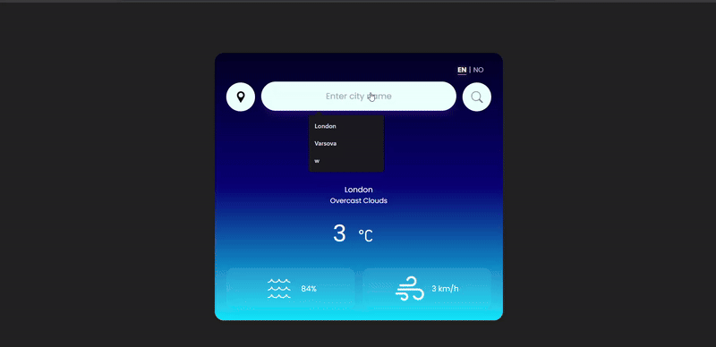

# 🌤️ Modern Weather App (JavaScript)
[🇺🇸 Click here for English README](./README.md)
Bu proje, kullanıcının girdiği şehir ismine veya mevcut konumuna göre anlık hava durumu verilerini gösteren, çoklu dil desteğine (İngilizce/Norveççe) sahip modern bir web uygulamasıdır.

## 🚀 Özellikler

* **Şehir Arama:** Dünyadaki herhangi bir şehrin anlık hava durumu verilerini getirir.
* **Konum Algılama (Geolocation):** Tarayıcı izni ile kullanıcının bulunduğu konumu otomatik tespit eder.
* **Çoklu Dil Desteği:** Arayüz ve hava durumu açıklamaları İngilizce (EN) ve Norveççe (NO) arasında geçiş yapabilir.
* **Dinamik Arayüz:** Hava durumu verilerine göre güncellenen ikonlar ve temiz UI tasarımı.
* **Hata Yönetimi:** Geçersiz şehir isimlerinde kullanıcıyı bilgilendiren hata mesajları.

## 🛠️ Kullanılan Teknolojiler

* **HTML5 & CSS3:** Semantik yapı ve Flexbox/Grid ile modern tasarım.
* **Vanilla JavaScript (ES6+):**
    * `Async/Await` ile asenkron API yönetimi.
    * DOM Manipülasyonu.
    * Event Listeners.
    * Fetch API.
* **OpenWeatherMap API:** Anlık meteorolojik veriler için.

---

## 🧠 Öğrenim Süreci & "Bug" Günlüğü

Bu projeyi geliştirirken karşılaştığım teknik zorluklar ve çıkardığım dersler:

### 1. DOM Manipülasyonu ve Seçiciler
* **Sorun:** `innerHTML` kullanarak verileri ekrana basarken, arama çubuğu ve dil butonları kayboluyordu.
* **Çözüm:** Ana kapsayıcıyı (`.card`) değil, sadece sonuçların gösterileceği alt kapsayıcıyı (`.weather-result`) hedeflemeyi öğrendim.
* **Ders:** DOM ağacında ebeveyn-çocuk ilişkisi ve doğru hedefleme çok kritik.

### 2. Değişken İsimlendirme ve Çakışmalar (Scope)
* **Sorun:** HTML elemanına `weather` ismini verip, API'den gelen veriyi de `weather` ismiyle destruct edince kod kırıldı.
* **Çözüm:** DOM elemanları için `Result`, `Container` gibi son ekler (suffix) kullanarak isimlendirme standardı getirdim (`weatherResult`).

### 3. CSS Flexbox Yapısı
* **Sorun:** Sıcaklık derecesi ve Celsius ikonu alt alta duruyordu.
* **Çözüm:** "Nested Flex" (İç içe Flex) yapısını kullanarak bu iki elemanı `temp-container` içinde grupladım ve `flex-direction: row` uyguladım.

### 4. API Logic & Hata Yönetimi
* **Sorun:** `if (response.ok)` diyerek hatalı bir mantık kurmuştum, başarılı isteklerde hata fırlatıyordu.
* **Çözüm:** Mantığı `if (!response.ok)` (başarılı DEĞİLSE) şeklinde düzelttim.

### 5. `null` Değer ve Seçici Hataları
* **Sorun:** `Uncaught TypeError: Cannot read properties of null` hatası.
* **Çözüm:** `querySelector` kullanırken ID'ler için `#`, Classlar için `.` kullanmanın farkını ve önemini kavradım. HTML'deki ID ile JS'teki seçicinin eşleşmesi gerektiğini öğrendim.

---

## 📸 Ekran Görüntüsü

*(Buraya projenin bitmiş halinin ekran görüntüsünü ekleyebilirsin: örn: )*

## 💻 Nasıl Çalıştırılır?

1.  Projeyi klonlayın veya indirin.
2.  `index.html` dosyasını tarayıcınızda açın.
3.  Bir şehir ismi girin veya konum ikonuna tıklayın!

---
*Geliştirici Notu: Bu proje, Frontend geliştirme yolculuğumda API entegrasyonu ve JavaScript mantığını pekiştirmek için yapılmıştır.*
